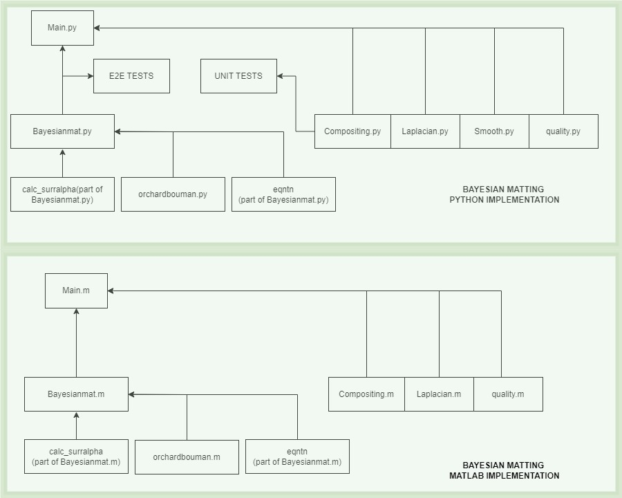

## 5C22 Computatational Method Assigment - Implementation of Bayesian Matting
Author - Group : Yin Yang Artistic Chaos (Yuning, Abhishek, Chai Jie)

The following project implements Bayesian Matting, stress tests its algorithms in forms of various unit and end to end tests and checks for novel solutions of improvement. The Main implementation is done in Python, however the main algorithm and performance metric functions have also been implemented in MATLAB. Please refer specific folders for MATLAB and Python code. The following project is part of 5c22 Computational Method course, taught as a part of Msc course in Trinity College Dublin.

A glimpse of how the output of the program looks, then sail through


---

## Table of Contents
1. [High-level Description of the project](#my-first-title)
2. [Installation and Execution](#my-second-title)
3. [Methodology and Results](#my-third-title)
4. [Extras](#my-fourth-title)
5. [Credits](#my-fifth-title) 

---
## High-level Description of the project

The code implemented here represents the bayesian method of image matting, as first explained in the paper, "A Bayesian Approach to Digital Matting" by Yung-Yu Chuang et all. The math and logic behind the main alogorithm is explained briefly in the project plan presentation [open presentation](https://github.com/ADG4050/Bayesian-Matting-Implementation/blob/main/Group2_week4_presentation%20.pdf)

The main code is based on initial code implemented by Michael Rubinistein, (check Credits section), on which further implementation is done to develop a revised algorithm, answering the shortcommings to Michael Rubinstein's code to the Alphamatting.com GT Dataset. Severe testing is performed on this algorithm to confirm its creditibility. 

To have a block level understanding of the functions involved in this project refer the image below. 



Basic functionality of the blocks

1) Main.py : Reads the image, trimap and Ground Truth, calculates the alpha matte using Bayesian_Mat.py, create the composite using compositing.py and plot the images for visual evaluation.
2) Bayesian_Mat.py : Holds the most important Bayesian Matting Overall function, along with eqntn (calculates the likelihood using mean and variance of FG and BG) and neighborhood window function (selects the window pixels around the unknown region pixel).
3) Orchard_bouman_clust.py : Clusters the Foreground and background pixels using orchard Bouman method.
4) Compositing.py : Creates a composite image with a new background with the new alpha matte.
5) Quality.py : This has the MSE, SAD and PSNR function for the end to end tests.
6) smooth.py : This smoothes some of the alpha matte not all using a erode function for blurred areas around the alpha matte.
7) laplac.py : creates the laplacian aplha matte so that it can be compared with the bayesian matting matte for end to end testing.
8) Unittest.py : This has 5 unit tests which checks whether the important functions are correctly being executed or not.
9) hist.py : File for end to end test no 3 : Histogram test, where we test do a visual histogram comaparision for the input and composite images. This works only for single screen backgrounds, difficult for different backgrounds which have same color element as foreground.

For MATLAB, we have almost similar .m files, but only for the main functions.

---

## Installation and Execution

1) The pipreqs $project/path/requirements.txt file available in this Github repo page provides all the versions and libraries of the import files used in the project, which will be helpful for installing this project through if a virtual ennvironment is created, using 'pip install import name'. 

For more details of how pipreqs work, check [here](https://github.com/bndr/pipreqs)

    i) matplotlib==3.6.2
    ii) numba==0.56.4
    iii) numpy==1.23.4
    iv) opencv_python==4.7.0.72
    v) Pillow==9.5.0
    vi) pip==22.2.2
    vii) psutil==5.9.4
    viii) scipy==1.9.3

2) Afer installing all the import packages, the main file (Main.py) can be run using the following command in the CMD terminal or by pressing the run python file UI icon.
```sh
python Main.py
```
3) A seperate file is made for the unit tests, which runs seperately to check the functionality of the important functions. To run the unittest file, use the following command in the CMD terminal or by pressing the run python file UI icon.
```sh
python Unittest.py
```
4) The images used for the tests are based on the image folder dataset available from alphmatting.com. For any external images, change the path accordingly.

5) For MATLAB implementation, once the .m diles are saved, it has to made sure that the change folder is selected, once the editor is run.


---
## Methodology and Results

Here we mainly discuss the unit tests and End to end tests used for testing out algorithm and final code.

**Unit tests**

Five unittests are used in this Bayesian matting project to check the functionality of the important parts individually.

1) Input Image Dimension check : This unit test confirms that the input image is of a three dimension image, which implies a grayscale image cannot be used as an input image.
2) Composite and Input Image Size check : This unit test checks the size and shape of input image and compositing image, confirming them to be same. This is in response to external background images being of different sizes and are trimmed or  expanded to the Input Image size.
3) Height and Width of Alpha Image check : This checks the height and weight of input image and alpha matte and confirms that they are same. This is one of function which confirms that Bayesian Matting output is correct provided they have the same image. 
4) Window size check : This checks and confirms the neighborhood window function in bayesian matting function, by confirming that the window function output is same as the selected window size. 
5) Mean and Co - Variance check: This pre-checks the orchard bouman function, as becuase the mean value for a single unknown region pixel should be a [3 X 1]Matrix and the co-variance matrix should be a [3 X 3] matrix. This confirms the same.

**End to End tests**

Three e2e tests are used in this Bayesian matting project to check the complete functionality of the algorithm.
1) Alpha matte comparsion between Bayesian matting and Laplacian matting : A comparision is made between the bayesian and the laplacian alpha matte's. The Laplacian matte is done using the inbuilt cv2 laplacian function. Bayesian being the probabilistic method, a higher matte performance is expected. MSE, PSNR and SAD with image base being (0-255), is used to prove that bayesian is better. A table showing the PSNR, SAD and MSE and grpah below confirms the results obtained. 


2. Performance evaluation.

i) low resolution trimap 1 vs trimap 2 : Here the test is performed with different Trimaps for the same image, with Trimap 2 having more unknown regions compared to Trimap 1. The PSNR, SAD and MSE is comapred along with time taken and memeory consumed throughout. A graph and table is shown below showing the results. 


ii) High resolution trimap vs low resolution trimap : For same images, trimap with higher resolution is comapred, having almost 6X more unknown points and results are tabled and plotted.  


iii) Hidden Ground truth images (Stress images) : These tests are performed on  images where foreground and background are similar, difficult to differentiate. Since no ground truth is available, the images are observed visually. The Matte works perfectly for normal textures, but fails for hair like structures.


To have an overall summary, the the alogorithm works very well for low resolution dataset, with low execution time but for high resolution it takes a lot of time. For, the hidden ground truth set, the results depends on the texture of the foreground of the image, it doesnt work well for too much hairy or fuzzy images.  

3. Comparing the two histograms between input image and composited image :
Initially the plan was to visually compare the similarity between the histograms of the input image and the composite image, with both having same foreground, a similar histogram is expected. However, with background having the similar color distribution with the foreground, this test dos'nt work that well. Hence, using a monochrome we make this work. Below are the test result for a black and white background image and a GT image. 


---
## Extras

1) Smoothening Filter : A smoothening filter was used for novelty purpose, which reoves blurs across the foreground border areas. This works well for rounded shaped foreground images, but works very badly for images which has hair and fuzzy interferences. Below are images where the filter worked and didnt worked is displayed.


2) Time Complexity and Memory Usage : Time taken to compute the matte and memory consumed for different trimaps are tabled above. The trend observed is with increase of unknown region, the time complexity increases, but for memory it depends on the cache value also.

3) Varying Window Technique : While, Michael Rubinstein's algorithm imples a fixed window for matte calculation, the code used here uses varying window technique, which increases when unsolvable pixels are encountered until a max window size.


4) MATALB vs Python Time & Quality Comparision : A Matlab vs Python Quality check with time taken was performed to check the better result, working in same specifications. We observe better Matte in MATLAB for GT-04 Image which has hair and better matte for GT-01 in python which has more textures. Time taken is almost similar for both. 


---
## Credits

This code was developed for purely academic purposes by the team Yin Yang Artistic Chaos [Yuning, Abhishek, Chai Jie] (https://github.com/ADG4050/Bayesian-Matting-Implementation) as part of the module 5c22 Computational Method, Trinity College Dublin. 

Resources:
- Yung-Yu Chuang, B. Curless, D. H. Salesin and R. Szeliski, "A Bayesian approach to digital matting,"
Proceedings of the 2001 IEEE Computer Society Conference on Computer Vision and Pattern Recognition.
CVPR 2001, Kauai, HI, USA, 2001
- Levin, A., Lischinski, D., & Weiss, Y. (2008). A closed-form solution to natural image matting. IEEE
Transactions on Pattern Analysis and Machine Intelligence, 30(2), 228–242.
- Michael Rubinstien baysian matting works (http://people.csail.mit.edu/mrub/bayesmat/index.html)
- Alpha Matting Website for Image Dataset and testing (http://www.alphamatting.com/datasets.php)


